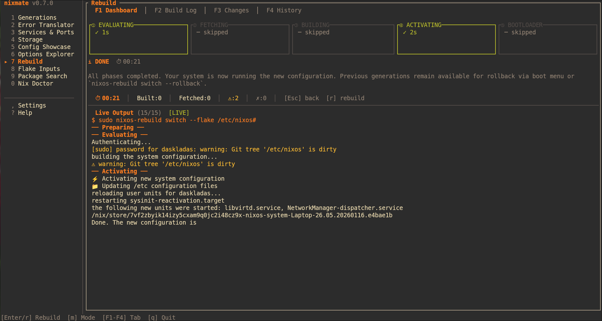

# nixmate

<p align="center">
  <a href="LICENSE"></a>
  <a href="https://nixos.org"></a>
  
</p>

<p align="center">
  
</p>

<p align="center">
  <strong>All your NixOS tools in one TUI.</strong><br>
  <sub>10 modules · 13 themes · EN/DE · works over SSH</sub>
</p>

<p align="center">
  <a href="#install">Install</a> · <a href="#modules">Modules</a> · <a href="#usage">Usage</a> · <a href="#configuration">Config</a> · <a href="#roadmap">Roadmap</a>
</p>

---

NixOS is powerful — but the day-to-day tooling is scattered across a dozen different commands with different interfaces. **nixmate** brings them all into one fast, keyboard-driven TUI. Desktop or headless server, local or SSH — same experience everywhere.

<p align="center">
  
</p>
<p align="center">
  
  
</p>

---

## Why?

NixOS is powerful, but managing it means juggling `nix-env`, `nixos-rebuild`,
`nix search`, `systemctl`, `nix-collect-garbage`, and a dozen other commands —
each with different flags, output formats, and gotchas. nixmate replaces that
workflow with one tool that works the same on your desktop, your server, and
over SSH.

---

## Install

```bash
# Try it instantly
nix run github:daskladas/nixmate

# Or add to your flake
inputs.nixmate.url = "github:daskladas/nixmate";
# Then add inputs.nixmate.packages.${system}.default to your systemPackages

# Or build from source
git clone https://github.com/daskladas/nixmate.git && cd nixmate
nix develop && cargo run
```

---

## Modules

Every module opens with an intro page explaining what it does, which problem it solves, and how to use it. Press Enter to dive in.

| Key | Module | What it does |
|-----|--------|-------------|
| `1` | **🕰️ Generations** | Browse, diff, delete, pin, restore generations. Side-by-side package comparison. Undo safety net. |
| `2` | **🔍 Error Translator** | Paste a Nix error → get a human explanation + fix. 50+ patterns. AI fallback via Claude/OpenAI/Ollama. |
| `3` | **🖥️ Services & Ports** | Systemd + Docker + Podman in one view. Port mapping. Start/stop/restart. Live logs. |
| `4` | **💾 Storage** | Disk dashboard. Store breakdown (live/dead paths). GC, optimize, full clean. History. |
| `5` | **🎨 Config Showcase** | Auto-generate a system poster + config architecture diagram as SVG. r/unixporn ready. |
| `6` | **🔧 Options Explorer** | search.nixos.org in your terminal. Fuzzy search + tree browsing + your current values vs defaults. |
| `7` | **⚡ Rebuild** | Live `nixos-rebuild` dashboard. 5-phase progress. Educational explanations. Post-build diff. |
| `8` | **📦 Flake Inputs** | Selective per-input updates. No more all-or-nothing `nix flake update`. Age tracking. Revision diffs. |
| `9` | **📦 Package Search** | Fuzzy search across 100k+ packages. Install status. Auto-detects Flakes vs Channels. |
| `0` | **🩺 Nix Doctor** | Health score 0–100%. 5 automated checks. One-click fixes. |

### Pipe mode

```bash
nixos-rebuild switch 2>&1 | nixmate    # auto-analyze build errors
nix build .#foo 2>&1 | nixmate         # works with any nix command
```

---

## Usage

| Key | Action |
|-----|--------|
| `1`–`9`, `0` | Switch module |
| `F1`–`F4` | Sub-tabs within a module |
| `j` / `k` | Navigate |
| `g` / `G` | Top / bottom |
| `Enter` | Select / confirm |
| `/` | Search / filter |
| `r` | Refresh data |
| `,` | Settings |
| `?` | Help |
| `q` | Quit |

**13 themes:** Gruvbox · Nord · Catppuccin · Dracula · Tokyo Night · Rosé Pine · Everforest · Kanagawa · Solarized Dark · One Dark · Monokai · Hacker · Transparent

**Languages:** English · Deutsch (bilingual UI with full error pattern translations)

**Terminal images:** Kitty · WezTerm · Ghostty · iTerm2 (auto-detected)

---

## Configuration

```
~/.config/nixmate/config.toml
```

```toml
theme = "gruvbox"           # 13 themes available
language = "english"         # english, german
layout = "auto"              # auto, sidebyside, tabsonly
welcome_shown = true         # false = show welcome screen again
nixpkgs_channel = "auto"    # auto-detect or manual override

# AI fallback for unknown errors (optional)
ai_enabled = false
ai_provider = "claude"       # claude, openai, ollama
ai_api_key = ""
ollama_url = "http://localhost:11434"
ollama_model = "llama3"
```

Everything can also be changed from the Settings module (`,`) inside the TUI.

---

## 🎨 Custom Themes

Want to create your own theme? It's easy — see [docs/developer/ADDING_THEMES.md](docs/developer/ADDING_THEMES.md) for a step-by-step guide. PRs with new themes are always welcome!

---

## Roadmap

See [CHANGELOG.md](CHANGELOG.md) for the full development history (v0.1–v0.7) and planned features.

---

## Contributing

Issues, PRs, themes, error patterns, translations — everything welcome.

```bash
git clone https://github.com/daskladas/nixmate.git
cd nixmate && nix develop && cargo run
```

Check out the [docs/](docs/) folder for user guides and developer guides on how to add modules, themes, and error patterns.

---

## License

MIT — see [LICENSE](LICENSE)

<p align="center">
  Made with ♥ by <a href="https://github.com/daskladas">daskladas</a><br>
  <sub>The goal: make nixmate a must-have for every NixOS user.</sub>
</p>
