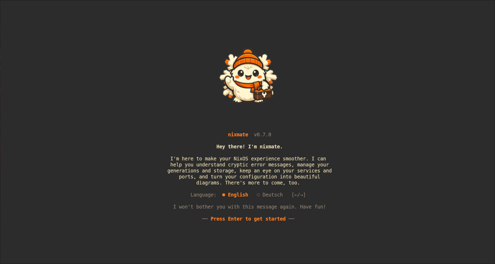

# nixmate

<p align="center">
  <a href="LICENSE"></a>
  <a href="https://nixos.org"></a>
  
</p>

<p align="center">
  
</p>

<p align="center">
  <strong>All your NixOS tools in one TUI.</strong><br>
  <sub>10 modules · 13 themes · EN/DE · works over SSH</sub>
</p>

---

NixOS is powerful, but managing it means juggling `nix-env`, `nixos-rebuild`,
`nix search`, `systemctl`, `nix-collect-garbage`, and a dozen other commands —
each with different flags, output formats, and gotchas. nixmate replaces that
workflow with one keyboard-driven tool that works the same on your desktop,
your server, and over SSH.

<p align="center">
  
</p>

---

## Install

```bash
# Try it instantly
nix run github:daskladas/nixmate

# Or add to your flake
inputs.nixmate.url = "github:daskladas/nixmate";
# Then add inputs.nixmate.packages.${system}.default to your systemPackages

# Or build from source
git clone https://github.com/daskladas/nixmate.git && cd nixmate
nix develop && cargo run
```

---

## Modules

Every module opens with an intro page explaining what it does and how to use it. Press Enter to dive in.

| Key | Module | What it does |
|-----|--------|-------------|
| `1` | **Generations** | Browse, diff, delete, pin, restore generations. Side-by-side package comparison. |
| `2` | **Error Translator** | Paste a Nix error, get a human explanation + fix. 50+ patterns. AI fallback (Claude/OpenAI/Ollama). |
| `3` | **Services & Ports** | Systemd + Docker + Podman in one view. Port mapping. Start/stop/restart. Live logs. |
| `4` | **Storage** | Disk dashboard. Store breakdown (live/dead paths). GC, optimize, full clean. |
| `5` | **Config Showcase** | Auto-generate a system poster + config architecture diagram as SVG. |
| `6` | **Options Explorer** | search.nixos.org in your terminal. Fuzzy search, tree browsing, current values vs defaults. |
| `7` | **Rebuild** | Live `nixos-rebuild` dashboard. 5-phase progress. Post-build diff. |
| `8` | **Flake Inputs** | Selective per-input updates. No more all-or-nothing `nix flake update`. |
| `9` | **Package Search** | Fuzzy search across 100k+ packages. Install status. Auto-detects Flakes vs Channels. |
| `0` | **Nix Doctor** | Health score 0-100. Automated checks with one-click fixes. |

### Pipe mode

```bash
nixos-rebuild switch 2>&1 | nixmate    # auto-analyze build errors
nix build .#foo 2>&1 | nixmate         # works with any nix command
```

---

## Keybindings

| Key | Action |
|-----|--------|
| `1`-`9`, `0` | Switch module |
| `[` / `]` | Previous / next sub-tab |
| `j` / `k` | Navigate |
| `g` / `G` | Top / bottom |
| `Enter` | Select / confirm |
| `/` | Search / filter |
| `r` | Refresh data |
| `,` | Settings |
| `?` | Help |
| `q` | Quit |

---

## Configuration

```
~/.config/nixmate/config.toml
```

```toml
theme = "gruvbox"           # 13 themes available
language = "english"         # english, german
layout = "auto"              # auto, sidebyside, tabsonly
nixpkgs_channel = "auto"    # auto-detect or manual override

# AI fallback for unknown errors (optional)
ai_enabled = false
ai_provider = "claude"       # claude, openai, ollama
ai_api_key = ""
ollama_url = "http://localhost:11434"
ollama_model = "llama3"
```

Everything can also be changed from the Settings panel (`,`) inside the TUI.

**Themes:** Gruvbox · Nord · Catppuccin · Dracula · Tokyo Night · Rosé Pine · Everforest · Kanagawa · Solarized Dark · One Dark · Monokai · Hacker · Transparent

**Languages:** English · Deutsch

---

## Known Issues

Working on fixes for these — feedback welcome.

- **Generations:** Packages and Diff tabs may show empty content depending on system configuration
- **Error Translator:** Crashes reported on some setups
- **Services:** May show incomplete data on non-systemd or containerized setups
- **Package Search:** Crashes or fails on some configurations

Most of these stem from assumptions about flake-based configs in `/etc/nixos`. Improving detection and error handling for non-flake and custom-path setups is the next priority.

---

## Contributing

Issues, PRs, themes, error patterns, translations — everything welcome.

```bash
git clone https://github.com/daskladas/nixmate.git
cd nixmate && nix develop && cargo run
```

See [docs/](docs/) for user guides and developer documentation.

### AI Disclosure

This project uses AI-assisted development. All code is reviewed, tested, and maintained by a human.

---

## License

MIT — see [LICENSE](LICENSE)

<p align="center">
  Made with ♥ by <a href="https://github.com/daskladas">daskladas</a>
</p>
